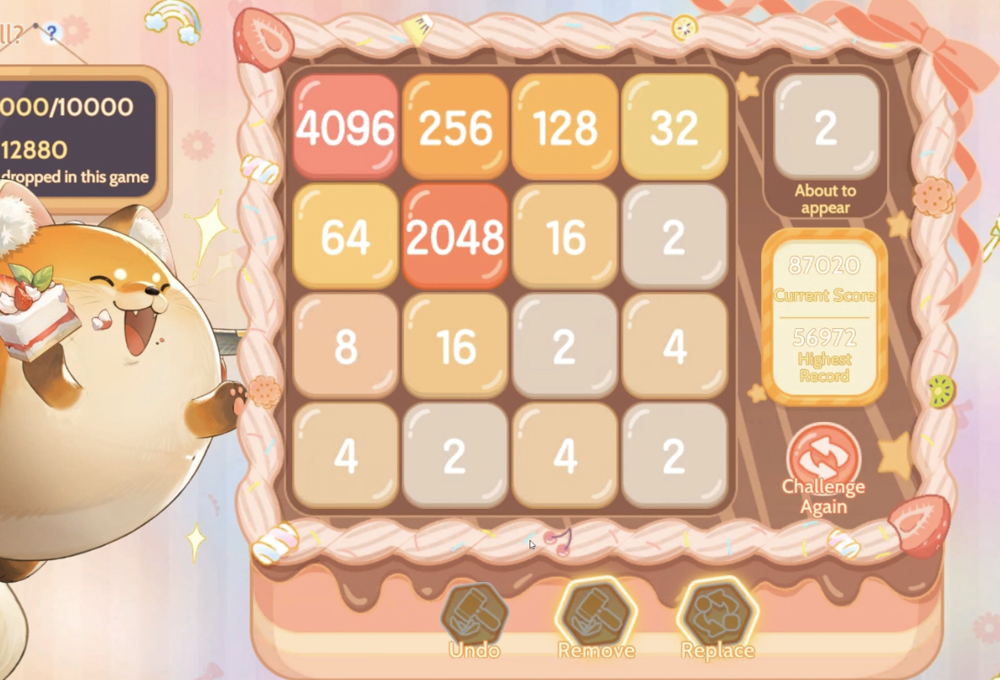
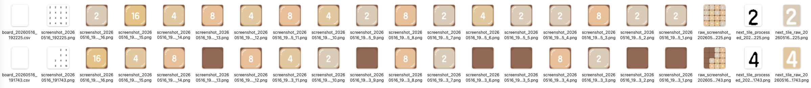
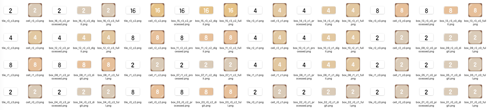

# Ragnarok ROOC (Where's Foxball?) 2048 Game AI Bot 🤖

An automated AI bot for playing Ragnarok ROOC (Where's Foxball?) 2048 directly from the screen (The game will block automated inputs anyway, so figure out some creative way to outsmart it 🤡). The bot captures the game board, reads the 4x4 tile state, optionally reads the next tile preview, evaluates the best move with an optimized expectimax search, and presses the matching arrow key with `pyautogui`.

> This project is designed for a Ragnarok-style 2048 variant. Tile detection can use either color matching or OCR with template caching.



## Screenshots and Debug Examples 🖼️

The `assets/` folder contains example images that document the game screen and OCR/debug output:

### Debug Capture Output



### Tile OCR Debug Crops



## Features 🎮

- ✅ Automatic screen capture for a calibrated board area.
- ✅ Optimized expectimax AI for choosing high-quality 2048 moves.
- ✅ Fast 64-bit board engine with lookup tables for row movement and heuristic evaluation.
- ✅ OCR-based board reading with OpenCV preprocessing and Tesseract.
- ✅ In-memory template matching cache to speed up repeated digit recognition.
- ✅ Next tile preview support for deterministic spawn evaluation when `next_tile_coordinates.txt` is available.
- ✅ Manual next-tile fallback when the preview area is not calibrated or OCR cannot read it.
- ✅ Debug capture mode for screenshots, tile crops, processed images, and board CSV files.
- ✅ Keyboard automation for `UP`, `RIGHT`, `DOWN`, and `LEFT` moves.

## Project Structure 📁

```text
├── test.py                    # Main bot entry point
├── board_reader.py            # Board detection via color matching, OCR, and template matching
├── calibrate.py               # Interactive calibration for board and next-tile preview coordinates
├── game_ai_enhanced.py        # Older/alternative AI implementation
├── requirements.txt           # Python dependencies
├── board_coordinates.txt      # Saved board coordinates: x0,y0,x1,y1
├── next_tile_coordinates.txt  # Saved next-tile preview coordinates: x0,y0,x1,y1
├── assets/                    # README screenshots and debug/OCR examples
│   ├── game_screensot.png
│   ├── capture_debug_screenshot.png
│   └── tiles_ocr_screenshot.png
└── capture_debug/             # Debug screenshots, tile crops, processed images, and CSV output
```

## Requirements 📦

- Python 3.9 or newer is recommended.
- Operating system permission for screen capture.
- Operating system permission for keyboard/mouse automation.
- Tesseract OCR is recommended for `--ocr` mode and next-tile preview reading.

Install Python dependencies:

```bash
pip install -r requirements.txt
```

Main dependencies:

- `mss` for screen capture
- `numpy` for board representation and calculations
- `Pillow` for image handling
- `pyautogui` for keyboard and mouse automation
- `opencv-python` for image preprocessing
- `pytesseract` for OCR
- `keyboard` and `pynput` for additional input support

### Install Tesseract OCR

macOS:

```bash
brew install tesseract
```

Ubuntu/Debian:

```bash
sudo apt-get install tesseract-ocr
```

## Quick Start 🚀

### 1. Install dependencies

```bash
pip install -r requirements.txt
```

### 2. Calibrate the game board

Open Ragnarok ROOC (Where's Foxball?) 2048 on your screen, then run:

```bash
python calibrate.py
```

Follow the prompts:

1. Move your mouse to the top-left corner of the game board and press Enter.
2. Move your mouse to the bottom-right corner of the game board and press Enter.

The coordinates are saved to:

```text
board_coordinates.txt
```

Coordinate format:

```text
x0,y0,x1,y1
```

Example:

```text
792,485,1220,913
```

### 3. Calibrate the next-tile preview area

If the game shows the next tile, calibrate that preview area too:

```bash
python calibrate.py --next-tile
```

The coordinates are saved to:

```text
next_tile_coordinates.txt
```

Example:

```text
1297,515,1333,561
```

If this file is missing, invalid, or OCR cannot read the preview, the bot asks for manual input:

```text
NEXT TILE (2/4):
```

### 4. Run the bot

OCR mode is recommended:

```bash
python test.py --ocr
```

Run with debug capture enabled:

```bash
python test.py --ocr --debug
```

Stop the bot with `Ctrl+C`.

## Available Commands 🧰

```bash
# Calibrate the main game board
python calibrate.py

# Calibrate the next-tile preview area
python calibrate.py --next-tile

# Run the bot with OCR tile detection
python test.py --ocr

# Run the bot with OCR and save debug images/CSV files
python test.py --ocr --debug

# Legacy calibration helper from test.py
python test.py --calibrate
```

## Runtime Flow 🔁

During each loop, the bot:

1. Reads the next tile (`2` or `4`) from the preview area.
2. Captures the calibrated board region from the screen.
3. Reads the 4x4 board state.
4. Prints the board as CSV.
5. Scores every legal move with expectimax.
6. Presses the matching arrow key.
7. Repeats until stopped or no legal move remains.

## Example Output 📊

```text
NEXT TILE: 2
BOARD CSV:
0,0,2,4
0,2,8,16
4,8,32,64
2,4,128,256
EXPECTIMAX DEPTH: 4 | NEXT TILE OCR: 2
EXPECTIMAX SCORES:
  UP: 12345678.90
  RIGHT: invalid/no board movement
  DOWN: 11990000.12
  LEFT: 14001234.56
BEST MOVE: LEFT

PERFORMED MOVE: LEFT
```

## How the AI Works 🧠

### Board Representation

- The board is a `4x4` grid.
- Empty cells are represented as `0`.
- Valid tiles are powers of two: `2`, `4`, `8`, `16`, and so on.
- The fast expectimax engine stores the board as a 64-bit integer.
- Each cell uses a 4-bit rank: `0` for empty, `1` for tile `2`, `2` for tile `4`, etc.

### Expectimax Search

The main bot in `test.py` uses expectimax search:

- **Player turn**: choose the legal move with the highest score.
- **Spawn/chance turn**: evaluate possible spawn positions.
- If the next-tile preview is available, the spawn tile value is treated as deterministic (`2` or `4`).
- Search depth is adjusted based on board fullness.

### Heuristics

The evaluation rewards or penalizes board states based on:

- Number of empty cells
- Merge potential
- Smoothness between neighboring tiles
- Monotonic rows and columns
- Keeping the largest tile in a corner
- Snake-style tile ordering from the active corner
- Keeping large tiles close together
- Avoiding moves that break a locked corner structure

## Board Detection 🔍

`board_reader.py` supports two board-reading approaches.

### 1. Color Detection

Color detection is fast, but depends on the configured color ranges in `TileDetector.TILE_COLORS`.

Use this only when the tile colors are stable and match the current Ragnarok-style color configuration.

### 2. OCR Detection (`--ocr`)

OCR mode is recommended for automated play because it reads the tile numbers directly.

The OCR pipeline:

1. Normalizes screenshots to RGB.
2. Splits the board capture into 16 tiles.
3. Crops the digit area from each tile.
4. Uses OpenCV masks and preprocessing to isolate digits.
5. Uses Tesseract to read numbers.
6. Caches known digit templates in memory for faster future frames.

## Debug Mode 🐞

Run:

```bash
python test.py --ocr --debug
```

Debug files are written to:

```text
capture_debug/
```

Example debug images are included in `assets/capture_debug_screenshot.png` and `assets/tiles_ocr_screenshot.png`.

Debug output may include:

- `raw_screenshot_*.png` — original board captures
- `screenshot_*.png` — processed board images
- `screenshot_*_1.png` through `screenshot_*_16.png` — individual tile crops
- `board_*.csv` — detected board states
- `next_tile_raw_*.png` — raw next-tile preview captures
- `next_tile_processed_*.png` — processed next-tile preview images
- `tiles/` — full, digit, and processed tile crops from OCR board reading

Use these files to tune crop areas, thresholds, or `TileDetector.TILE_COLORS` when detection is inaccurate.

## Common Configuration ⚙️

### Board Coordinates

Edit:

```text
board_coordinates.txt
```

Format:

```text
x0,y0,x1,y1
```

Or recalibrate:

```bash
python calibrate.py
```

### Next-Tile Coordinates

Edit:

```text
next_tile_coordinates.txt
```

Or recalibrate:

```bash
python calibrate.py --next-tile
```

### Move Interval

The bot is created near the bottom of `test.py`:

```python
bot = Game2048AI(
    x0,
    y0,
    x1,
    y1,
    next_tile_coords=next_tile_coords,
    move_interval=0.3,
    use_ocr=use_ocr,
    debug=debug,
)
```

### Tile Color Ranges

To adjust color-based detection for a different theme, edit `TileDetector.TILE_COLORS` in:

```text
board_reader.py
```